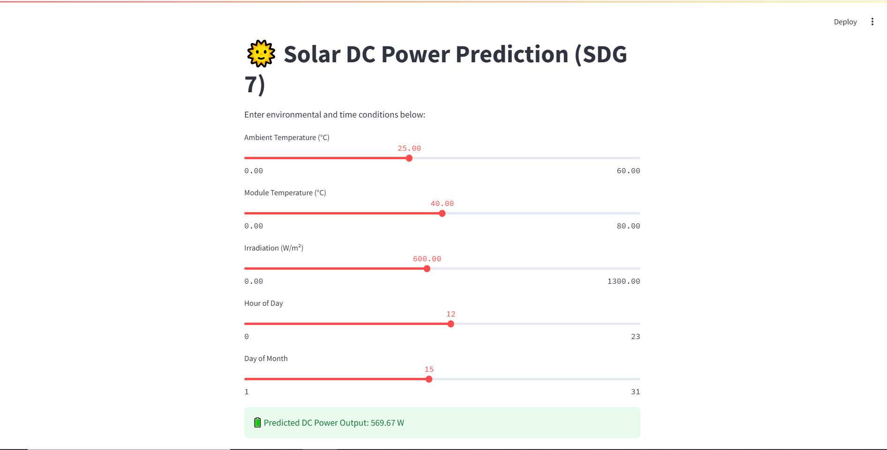
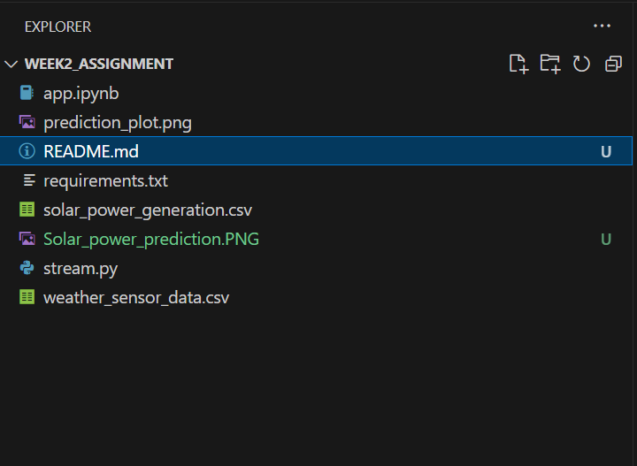

# 🌞 Solar Power Generation Prediction

## Overview

This project uses **machine learning (Random Forest Regression)** to predict DC power output from solar panels based on weather and time data, supporting the **United Nations Sustainable Development Goal (SDG) 7: Affordable and Clean Energy**.

---

## 🔍 Problem Statement

Solar energy generation is influenced by environmental factors. Accurately predicting solar power potential helps in better planning, utilization, and investment in renewable infrastructure, especially in regions with limited resources.

---

## 📊 Dataset

* **Source**: Kaggle - [Solar Power Generation Data](https://www.kaggle.com/datasets/anikannal/solar-power-generation-data)
* **Files Used**:

  * `solar_power_generation.csv`
  * `weather_sensor_data.csv`

---

## 🧠 ML Approach

* **Model**: Random Forest Regressor
* **Features**:

  * Ambient Temperature
  * Module Temperature
  * Irradiation
  * Hour of the Day
  * Day of the Month
* **Target**: DC Power
* **Libraries**: scikit-learn, pandas, numpy, streamlit

---

## 🧪 Results

* R² score \~0.90 on test data
* MAE lower with Random Forest compared to Linear Regression

---

## ⚖️ Ethics & Sustainability

* **Fairness**: Useful to low-resource areas for better solar deployment
* **Bias Awareness**: Model trained on Indian solar farms; regional adaptation may be needed
* **Impact**: Aligns with SDG 7 to enable cleaner, efficient energy planning

---

## 🚀 Streamlit App

Run the web app to test predictions interactively:

```bash
streamlit run stream.py
```

Inputs:

* Ambient Temperature
* Module Temperature
* Irradiation
* Time of Day

Output:

* Predicted DC Power (in Watts)

---

## 📁 Project Structure

```
├── app.ipynb                  # Data exploration notebook
├── stream.py                  # Streamlit app
├── solar_power_generation.csv
├── weather_sensor_data.csv
├── README.md
└── prediction_plot.png        # Output visual
```

---

## 📷 Screenshots


